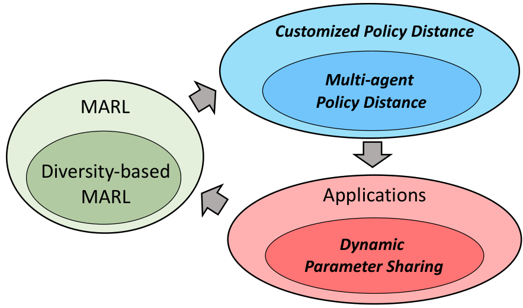
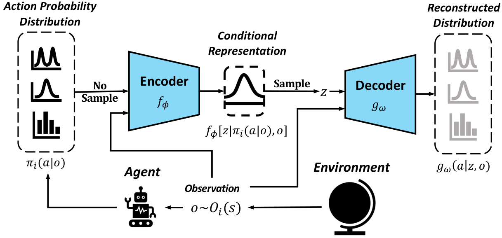
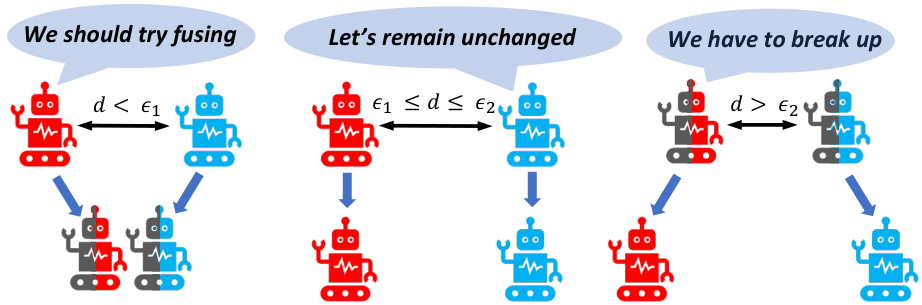
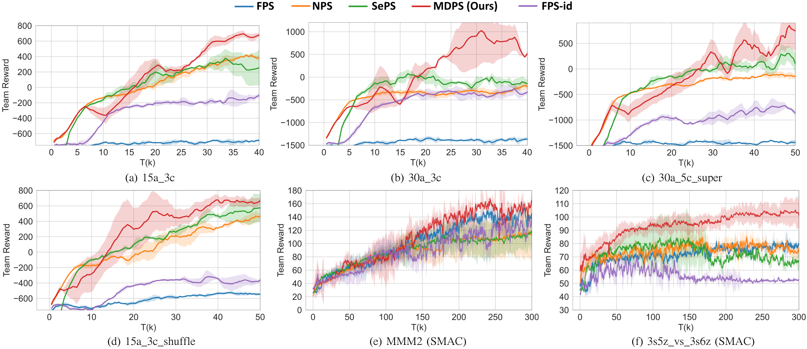
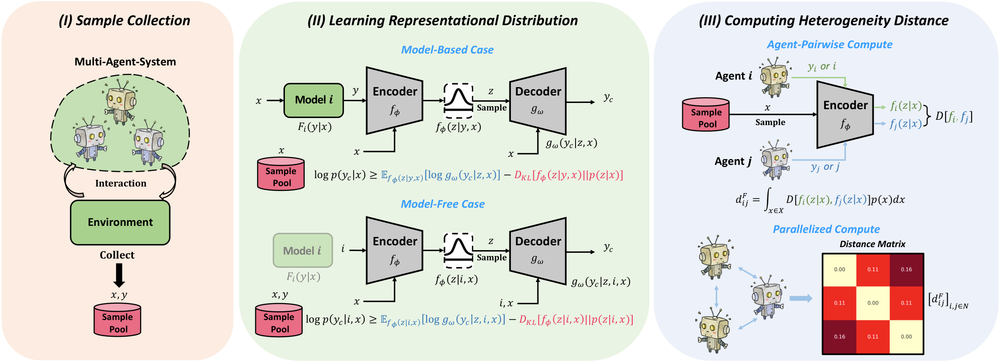
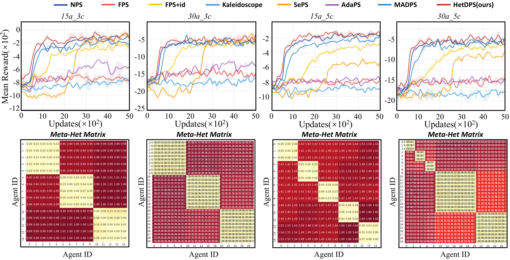

# Multi-agent Dynamic Parameter Sharing (MADPS)

[English](README.md) | [中文](README_CN.md)

[](https://aamas2024-conference.auckland.ac.nz/)
[](https://arxiv.org/abs/2512.22941)
[](https://arxiv.org/abs/2401.11257)
[](https://www.python.org/downloads/)
[](https://pytorch.org/)

---

## 🏛️ About This Repository

This repository is maintained by **[CASIA-Collect-AI](https://github.com/CASIA-Collect-AI)**, a curated collection of high-quality MARL research code.

📌 **Original Repository (Recommended):** [Harry67Hu/MADPS](https://github.com/Harry67Hu/MADPS)
⭐ **If this work is helpful, please Star the original repository to support the authors!**

> **Team:** Intelligent Flight Technology Team (Swarm Intelligence Group), Institute of Automation, Chinese Academy of Sciences (CASIA), led by Prof. Zhiqiang Pu.
> CASIA-Collect-AI curates and maintains high-quality open-source research code in MARL, LLM, and robotics.

---

Official implementation of **Measuring Policy Distance for Multi-Agent Reinforcement Learning** (AAMAS 2024).

**Authors:** Tianyi Hu, Zhiqiang Pu, Xiaolin Ai, Tenghai Qiu, Jianqiang Yi
**Affiliations:** Institute of Automation, Chinese Academy of Sciences; National Key Laboratory of Cognition and Decision Intelligence for Complex Systems; University of Chinese Academy of Sciences

---

## Abstract

This paper proposes **MADPS** (Multi-agent Dynamic Parameter Sharing), a method for measuring *policy distance* in multi-agent reinforcement learning (MARL) and utilizing it for dynamic parameter sharing.

- **Policy Distance Measurement:** We train a Conditional VAE to learn conditional representations of agents' decisions, then compute multi-agent policy distance matrices between agents.
- **Dynamic Parameter Sharing:** Based on the policy distance matrix, we automatically adjust the parameter sharing scheme among agents, enabling more flexible and interpretable multi-agent learning.


*The relationship between our contributions and MARL. Contributions are highlighted in bold and italics.*

---

## 📖 Paper Deep Dive

### The Problem: Parameter Sharing Dilemmas in MARL

**Parameter Sharing** is a core technique for sample efficiency in MARL, but traditional methods have significant flaws:

- **Fully Parameter Sharing (FPS):** Forces all agents to use the same network. When agents have different objectives (e.g., different-colored agents must move in different directions), conflicting gradients cause the network to oscillate—and can completely fail under sparse rewards (reward ≈ 0).
- **Selective Parameter Sharing (SePS):** Uses fixed clustering based on pre-learned representations. The clustering scheme is frozen during training, missing dynamic policy evolution; each new task requires manual hyperparameter tuning (cluster count K), limiting generalization.

**The root gap:** There is no general metric to quantify policy differences between agents, making it impossible to determine which agents *should* share parameters.

---

### Method: MAPD + MADPS

#### Step 1: Learning Policy Representations with Conditional VAE

Directly comparing action distributions across agents is difficult—different agents may face different observation spaces or have heterogeneous action types. MADPS trains a **CVAE** to map all policies into a unified latent space:

- **Encoder:** Input `(action distribution π_i(a|o), observation o)` → latent posterior `q(z|π_i, o)`
- **Decoder:** Reconstruct action distribution from `z` and `o`
- Training uses known policy distributions directly, **avoiding the inefficiency of environment sampling**


*Learning the conditional representation of an agent's decision via CVAE.*

#### Step 2: Computing Multi-Agent Policy Distance (MAPD)

In the latent space, policy distances are computed via **Wasserstein distance** integrated over observations:

```
d_ij = ∫ W[p_i(z|o), p_j(z|o)] do
```

This unifies Gaussian, bimodal, and discrete distributions into a comparable latent space. Wasserstein is chosen over KL divergence because it remains meaningful when distributions have no overlap—crucial for the mode-separation patterns common in MARL.

#### Step 3: Dynamic Parameter Sharing (MADPS)

Based on the policy distance matrix, MADPS executes merge/split operations every T steps:

- **Fusion:** `d_ij < ε₁` → merge parameters to improve efficiency
- **Division:** `d_ij > ε₂` → decouple parameters to maintain diversity
- **Design constraint:** `ε₂ ≥ 2ε₁` (derived from the triangle inequality to prevent oscillation)


*The basic idea of dynamic parameter sharing: agents with similar policies share parameters; divergent agents separate.*

The sharing scheme **self-adapts** throughout training—no manual cluster count required.

---

### Experimental Results

**Test environment:** PettingZoo MPE Large-Spread (6 difficulty variants v1–v6)

| Variant | Agents | Landmarks | Features |
|---------|--------|-----------|----------|
| v1 | 15 | 3 | Baseline |
| v2 | 30 | 3 | Large-scale |
| v3–v6 | 30 | 5 | Heterogeneous / shuffled observations |


*Performance comparison with baselines on multi-agent spread tasks and SMAC super-hard tasks.*

**Key findings:**
- **FPS completely fails** on sparse-reward tasks (heterogeneous objectives cause gradient conflicts)
- **MADPS consistently outperforms all baselines** across all 6 variants with a single set of hyperparameters
- **SePS** is unstable on heterogeneous maps and requires per-task manual tuning of K

---

## 🚀 Extended Work: HetDPS (AAMAS 2026)

> Full extension published at AAMAS 2026! See [arXiv:2512.22941](https://arxiv.org/abs/2512.22941)

MADPS only explicitly leverages **policy heterogeneity**. HetDPS extends this to a complete heterogeneity framework:

**Five Types of Heterogeneity:**
1. **Observation Heterogeneity:** Differences in how agents perceive global information
2. **Response Transition Heterogeneity:** Differences in how environmental factors affect each agent's state
3. **Effect Transition Heterogeneity:** Differences in how agents' actions impact the overall system
4. **Objective Heterogeneity:** Differences in reward functions
5. **Policy Heterogeneity:** Differences in decision-making based on observations *(MADPS covers only this)*


*HetDPS: measuring heterogeneity distance via representation learning across all five heterogeneity types.*

**HetDPS Key Advantages:**
- Introduces **Meta-Heterogeneity Distance** to holistically quantify all heterogeneity dimensions
- Eliminates task-specific hyperparameters (no need to set cluster count K)
- Enhanced interpretability through visualizable distance matrices


*HetDPS results on Particle-based Multi-agent Spreading tasks, achieving optimal or comparable performance.*

---

## Installation

```bash
conda create --name madps --file requirements.txt
conda activate madps
```

> Replace `pettingzoo/mpe/scenarios/large_spread.py` with `large_spread_example.py` from this repo to access the upgraded task variant.

---

## Quick Start

```bash
python ac_NF.py with env_name='pettingzoo:pz-mpe-large-spread-v1' time_limit=50
python ac_NF.py with env_name='pettingzoo:pz-mpe-large-spread-v2' time_limit=50
# v3–v6 similarly
```

---

## Citation

```bibtex
@inproceedings{hu2024MAPD,
  title={Measuring Policy Distance for Multi-Agent Reinforcement Learning},
  author={Hu, Tianyi and Pu, Zhiqiang and Ai, Xiaolin and Qiu, Tenghai and Yi, Jianqiang},
  booktitle={Proceedings of the 23rd International Conference on Autonomous Agents and Multiagent Systems (AAMAS 2024)},
  pages={834--842},
  year={2024}
}

@article{hu2025HetDPS,
  title={Heterogeneity in Multi-Agent Reinforcement Learning},
  author={Hu, Tianyi and Pu, Zhiqiang and others},
  journal={arXiv preprint arXiv:2512.22941},
  year={2025}
}
```

---

## Contact

- **First Author:** hutianyi2021@ia.ac.cn (Tianyi Hu)
- **Corresponding Author:** zhiqiang.pu@ia.ac.cn (Zhiqiang Pu)
